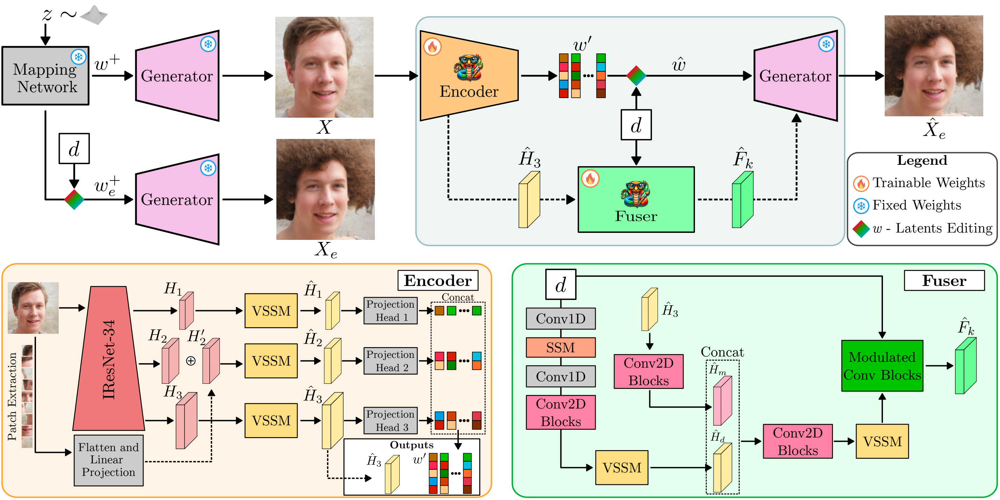

# MambaStyle: Efficient and Effective StyleGAN Inversion

Welcome to **MambaStyle**, a PyTorch-based toolkit for efficient and effective StyleGAN inversion and image manipulation. This repository is inspired by the E2Style approach, providing streamlined workflows for training, inference, and advanced GAN-based image editing.

- **Project Page:** [Link](https://wty-ustc.github.io/inversion)
- **Paper:** [E2Style: Improve the Efficiency and Effectiveness of StyleGAN Inversion (TIP 2022)](https://wty-ustc.github.io/inversion/paper/E2Style.pdf)
- **Demo Video:** [YouTube](https://youtu.be/gJwFgdRHK0M)



---

## Table of Contents

- [News](#news)
- [Getting Started](#getting-started)
- [Pretrained Models](#pretrained-models)
- [Training](#training)
- [Testing & Inference](#testing--inference)
- [Advanced Features](#advanced-features)
- [Acknowledgements](#acknowledgements)
- [Citation](#citation)

---

## News

<!--- **2022.03.26:** Paper accepted by IEEE Transactions on Image Processing (TIP)!-->
- **2025.08.01:** Initial code release.

---

## Getting Started

### Prerequisites

Install dependencies:
```bash
conda install --yes -c pytorch pytorch=1.7.1 torchvision cudatoolkit=11.0
pip install matplotlib scipy opencv-python pillow scikit-image tqdm tensorflow-io
```
For secure deep hiding, install the [MATLAB Engine for Python](https://www.mathworks.com/help/matlab/matlab_external/install-the-matlab-engine-for-python.html).

---

## Pretrained Models

Download pretrained models for various tasks:

| Task | Model |
|------|-------|
| StyleGAN Inversion | [Download](https://drive.google.com/file/d/1CzMDA88GJgVzc5JxKt3-l504a7TuSw5j/view?usp=sharing) |
| Colorization | [Download](https://drive.google.com/file/d/17Ht2e0Hr9wqkinHwlRQ_xGnSRvhZPioS/view?usp=sharing) |
| Denoising | [Download](https://drive.google.com/file/d/17INPNHGMwDhu3FBIxSJjdn59SrkK7Sr6/view?usp=sharing) |
| Inpainting | [Download](https://drive.google.com/file/d/1vLkDzKXguqslC06e80ZHhLUs7cHv03Wr/view?usp=sharing) |
| Super Resolution | [Download](https://drive.google.com/file/d/1nXZjaxo_CDLh3_QmmiHjQlQXBqvlnrNZ/view?usp=sharing) |
| Sketch to Image | [Download](https://drive.google.com/file/d/13aoBbU8n8DLWg531Ul3Ngp-vWVlW5oXD/view?usp=sharing) |
| Segmentation to Image | [Download](https://drive.google.com/file/d/1eH5qB9PZjlRACCj7pfe24266igzYkp89/view?usp=sharing) |

Auxiliary models (save to `pretrained_models` or update `configs/path_configs.py`):

| Model | Description |
|-------|-------------|
| [FFHQ StyleGAN](https://drive.google.com/file/d/1pts5tkfAcWrg4TpLDu6ILF5wHID32Nzm/view?usp=sharing) | 1024x1024 StyleGAN (from [rosinality](https://github.com/rosinality/stylegan2-pytorch)) |
| [IR-SE50](https://drive.google.com/file/d/1FS2V756j-4kWduGxfir55cMni5mZvBTv/view?usp=sharing) | Pretrained IR-SE50 (from [TreB1eN](https://github.com/TreB1eN/InsightFace_Pytorch)) |

---

## Training

### Data Preparation

- Configure data and model paths in `configs/paths_config.py`.
- Set up data transforms in `configs/transforms_config.py`.
- Define train/test splits in `configs/data_configs.py`.

To use your own dataset, update the above configs accordingly.

### Training Examples

**Stage 1 Encoder Training:**
```bash
python scripts/train.py \
  --dataset_type=ffhq_encode \
  --exp_dir=/path/to/experiment \
  --workers=4 --batch_size=4 --test_batch_size=4 --test_workers=4 \
  --val_interval=5000 --save_interval=5000 \
  --start_from_latent_avg \
  --lpips_lambda=0.8 --l2_lambda=1 --id_lambda=0.5 --parse_lambda=1 \
  --training_stage=1
```
**Continue to Stage 2/3:**  
Update `--checkpoint_path` and `--training_stage` accordingly.

**Other Tasks:**  
Change `--dataset_type` for colorization, denoising, inpainting, sketch-to-face, segmentation, or super-resolution.  
See `options/train_options.py` for all flags.

---

## Testing & Inference

**Basic Inference:**
```bash
python scripts/inference.py \
  --exp_dir=/path/to/experiment \
  --checkpoint_path=experiment/checkpoints/best_model.pt \
  --data_path=/path/to/test_data \
  --test_batch_size=1 --test_workers=4 --stage=1 \
  --save_inverted_codes --couple_outputs --resize_outputs
```
- Most options are loaded from the checkpoint.
- Use `--stage` to select the output stage.
- For super-resolution, set a single `--resize_factors` value.

**Output:**
- Results saved in `inference_results` (and `inference_coupled` if `--couple_outputs` is set).
- Latent codes saved if `--save_inverted_codes` is set.

---

## Advanced Features

- **Secure Deep Hiding:**  
  ```bash
  python scripts/secure_deep_hiding.py --exp_dir=... --checkpoint_path=... --secret_dir=... --cover_dir=...
  ```
- **Semantic Editing:**  
  ```bash
  python scripts/manipulate.py --exp_dir=... --checkpoint_path=... --deriction_name=age --edited_dir=...
  ```
- **Style Mixing:**  
  ```bash
  python scripts/stylemixing.py --exp_dir=... --checkpoint_path=... --style_dir=... --content_dir=...
  ```
- **Interpolation:**  
  ```bash
  python scripts/interpolate.py --exp_dir=... --checkpoint_path=... --source_dir=... --target_dir=...
  ```

*Note: For these features, run inversion first with `--save_inverted_codes`.*

---

## Acknowledgements

MambaStyle builds on the foundations of [pSp](https://github.com/eladrich/pixel2style2pixel) and [idinvert](https://github.com/genforce/idinvert_pytorch).

---

## Citation

If you use MambaStyle in your research, please cite:

```
@article{wei2022e2style,
  title={E2Style: Improve the Efficiency and Effectiveness of StyleGAN Inversion},
  author={Wei, Tianyi and Chen, Dongdong and Zhou, Wenbo and Liao, Jing and Zhang, Weiming and Yuan, Lu and Hua, Gang and Yu, Nenghai},
  journal={IEEE Transactions on Image Processing},
  year={2022}
}
```

---

Let me know if you want to further customize the README (e.g., add badges, update author list, or clarify any section)!

